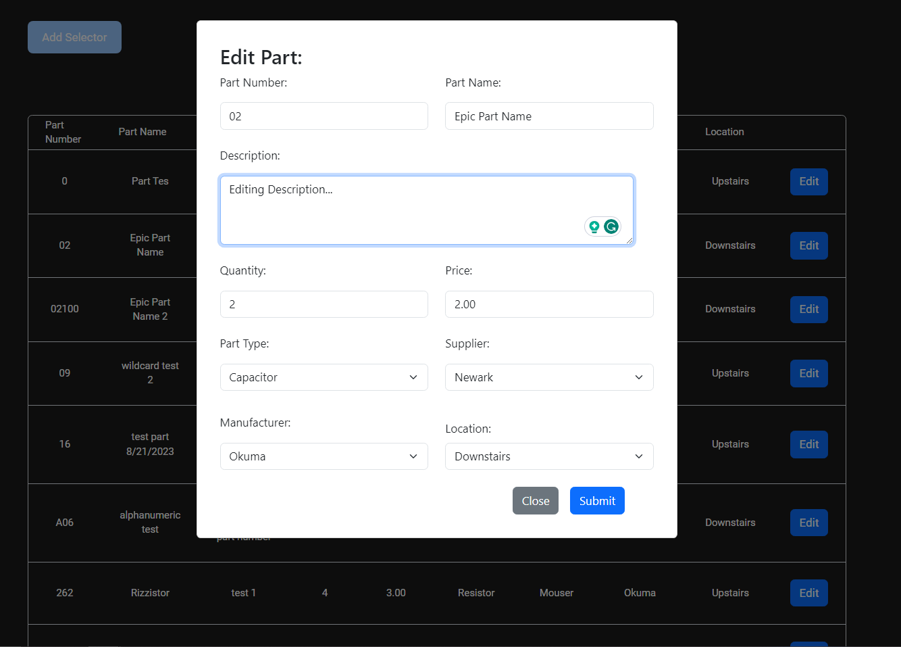

# Website / Web App for LC Industrial

I made this web app as an inventory management system for LC Industrial Services. The company has a large inventory of parts, so tracking and searching data on these parts in a manageable way was very difficult for them.

## What does the app do?
The app keeps track of information like Part Number, Supplier, Quantity, Price, and others. 
With this web app, they're able to now catalog their parts and easily maintain a database with part information thanks to the search, editing, and adding functionality.

### Searching For Parts:
#### Select from a number of fields:

#### Dynamically add to fields:

### Editing Parts:

### Adding New Parts:

## What did I learn?
I made this app using a React front-end, an Express back-end for the API and a MySQL database. I learned a lot about managing data in all stages of the application, from the front-end form to the back-end API and finally the SQL query for the database.

